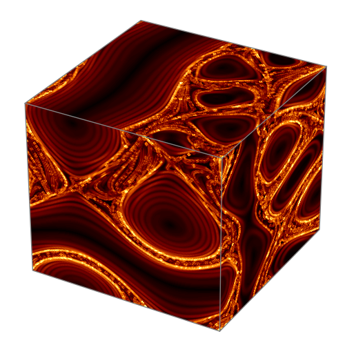
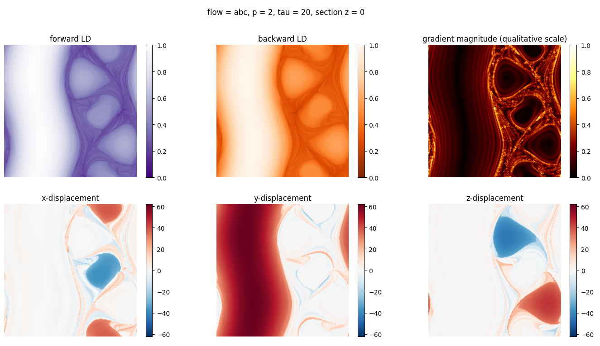

## LDflow

`ldflow` builds on top of [`ldds`](https://github.com/champsproject/ldds) to make it (easily) usable for Lagrangian particles in fluid flows.

# Install
To create a dedicated virtual environment, use
``` bash
conda create --name ldflow python
conda activate ldflow
```

Install the `ldds` package with

``` bash
pip install git+https://github.com/champsproject/ldds.git
```

Clone the `ldflow` repository
```bash
git clone git@github.com:auroreloisy/ldflow.git
```

# Usage

Use `plot_cube.py` to visualize Lagrangian structures on the faces of a cube.

<div align="center">

</div>
 
Use `plot_section.py` to plot quantities of interest in a section.
<div align="center">

 </div>


